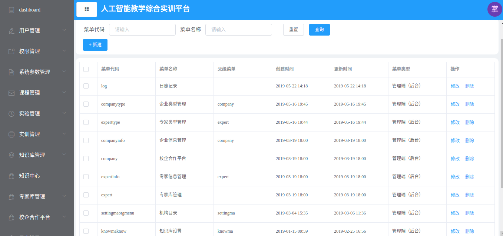
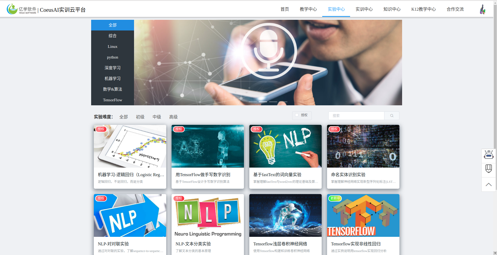
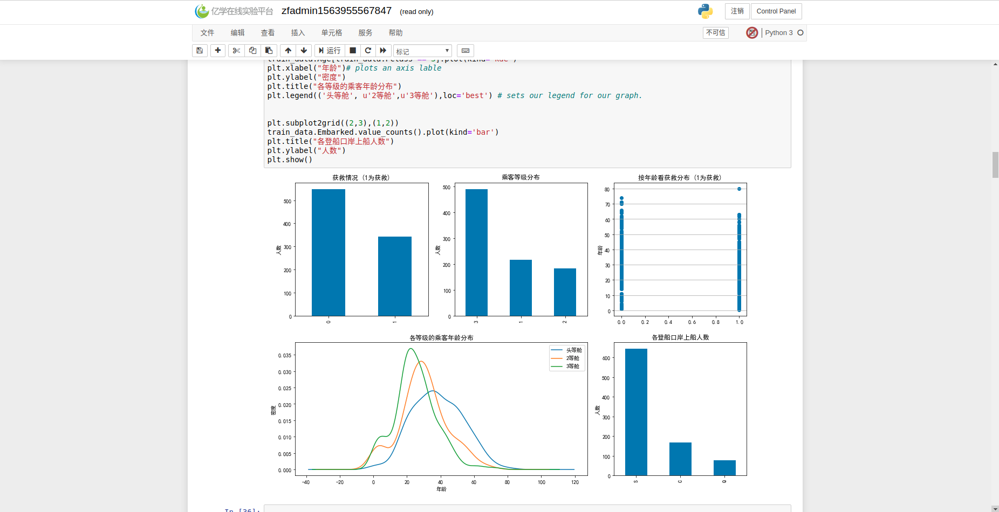
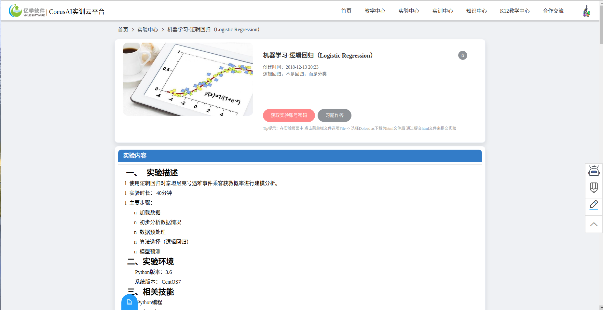
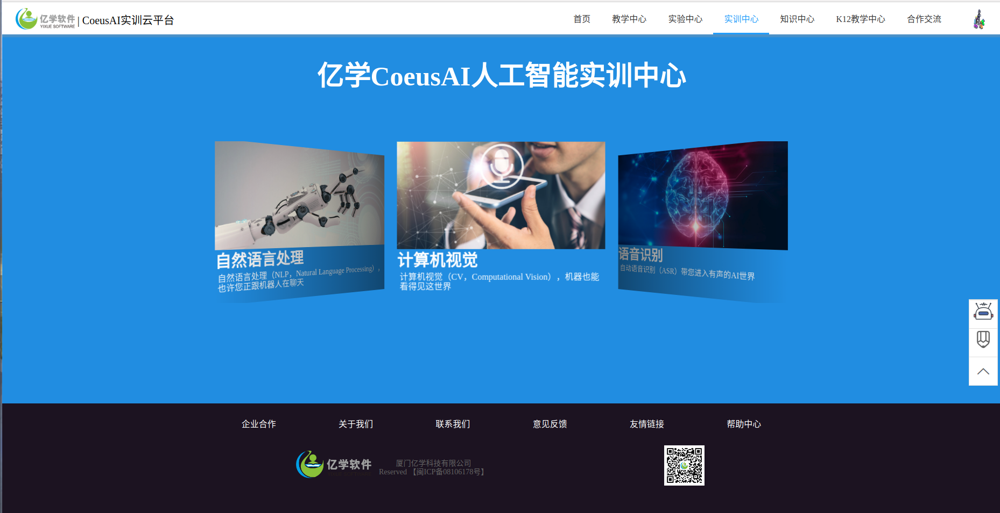
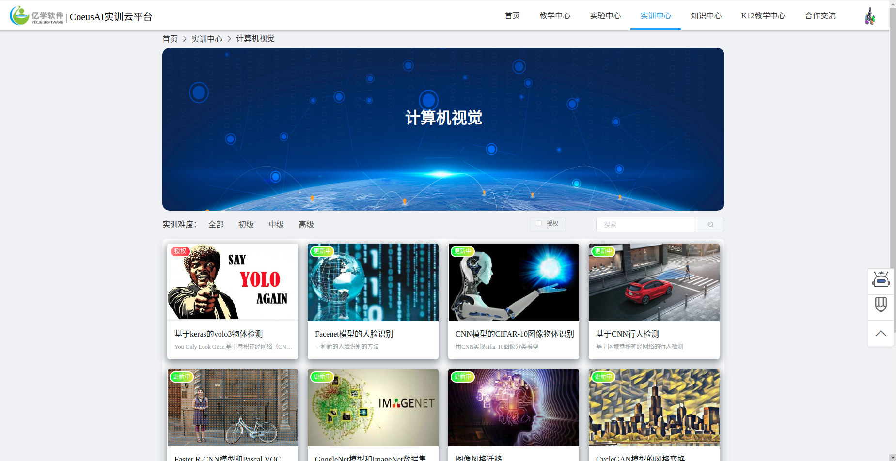
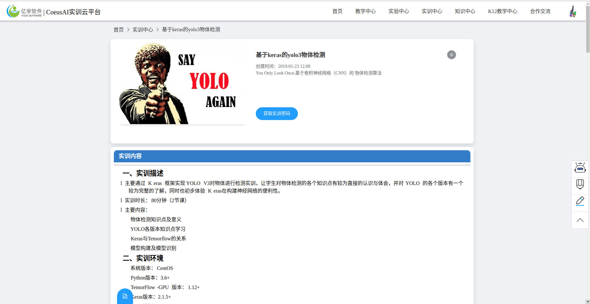
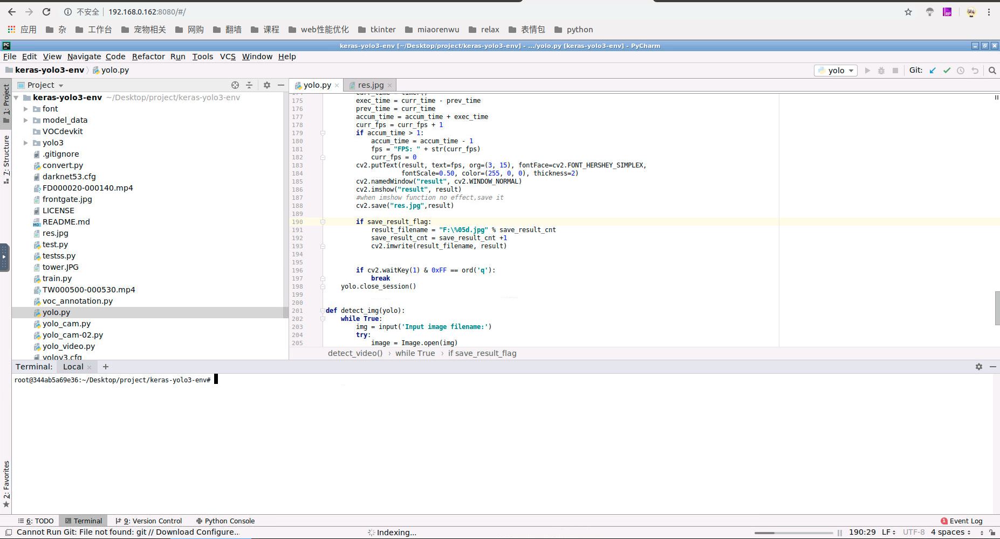

# coeusai

一个人工智能在线教育综合实训平台框架 A Framework of Integrated Training Platform for Artificial Intelligence Online Education

#Preface

这是个展示工程，并不包含工程源码。本工程会简单介绍实现的逻辑和体验链接。目的是分线这类项目的设计经验和寻找需要这方面技术服务的商业需求方。

#Introduction

一、 Coesuai是一个分布式框架，核心的功能模块是提供在线python编译环境和线上虚拟机，通过web交互实现人工智能课程的便捷式实验操作，而帮助用户
免去繁琐的环境配置初始化流程。

二、 Coesuai是一个综合性在线教育网站的解决方案，他保留了常规类教育网站的核心功能，如视频/音频等多媒体资源的交互模式，完整的后台标准权限
（机构/学生/管理员）等，完全自由的定制化权限操控，基于前后端分离的设计理念但在后端保留了部分前端模块的渲染机制控制。课堂小测，客服机器人，
课堂笔记等功能。理论上来说，这套框架就说不用于人工智能领域，也可以应付传统类课程的教学需求。

三、 整套框架的部署已经通过容器技术(Docker)进行了封装，方便使用者进行快速部署。包含:

1核心服务模块(教师端/学生端 web程序)。

2实验设备模块(基于notebook改造，可同时支持20个学生进行隔离化实验操作，并自动传输对应实验的编码文件)

3实训设备模块(基于vnc开发，使用ubuntu系统，内置anaconda及tensorflow等开发环境,内置pycharm等coding工具)

4完整的部署文档及初始化sql数据，通过容器外部的配置文件进行统一配置规划，通过运行脚本一键部署。

5兼容B/C 双端部署方案 。 支持云对象存储方案，支持redis组件，自带加密组件和异步高并发方案。

#Show 效果展示（图片）

#由于我自己的个人服务器空间不足，近期会购买的新服务器进行体验版部署，完成后会公布体验链接。

有意向了解或合作的伙伴可以联系邮件 redtree@aliyun.com